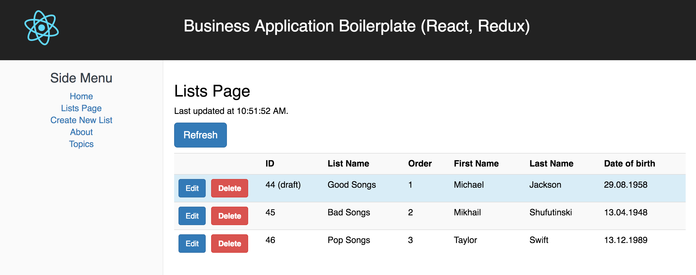

## Business React Redux Boilerplate Project

This is demo project for creating Business Applications using React, Redux.



This project was bootstrapped with [Create React App](https://github.com/facebookincubator/create-react-app).

### How to try

1. Clone the project `git clone git@github.com:klishevich/business_react_boilerplate.git`
2. Edit file `/src/constants.js` and set `export const url = 'http://react_redux_api_rails5.j123.ru'`
3. Install node modules with command `yarn`
4. Start development server `yarn start`
5. Run tests `npm test -- --coverage`

**If your want to use local server**

Clone Ruby on Rails project - https://github.com/klishevich/react_redux_api_rails5

### How to contribute

1. Make Fork
1. Choose task from Roadmap
2. Develop and have fun
3. Commit and push to Github
4. Make Pull Request
5. I make code review and give feedback
6. I merge feature to master. You are cool, thanks for your contribution to opensource!

### Project Roadmap

1. ~~create-react-app~~
1. ~~Redux~~
1. ~~ESLint~~
1. ~~Get list of items page~~
1. ~~Delete item~~
1. ~~Add React Router~~
2. ~~Edit item page~~
3. Flash Messages in separate container
3. Create item page
3. ~~Hot Reload~~
3. Tests
4. Validations for saving form
5. Dictionaries
5. Deployment to Production
6. Nested attributes
7. Data normalization
7. Selectors (Reselect)
8. CSS Modules
9. Authentication (JWT)
9. Authorization

**Maybe**

1. Server-side rendering 
1. React Router Redux
1. Components Library

### I have cloned the project, what else to do?

Make the same functionality as for model List (display index, create, update, delete) for model Singer.
Available at the endpoint `http://react_redux_api_rails5.j123.ru/singers`

```ruby
create_table "singers", force: :cascade do |t|
  t.string   "first_name"
  t.string   "last_name"
  t.integer  "order"
  t.date     "birth_date"
  t.boolean  "is_alive",   default: true
  t.datetime "created_at",                null: false
  t.datetime "updated_at",                null: false
end
```
